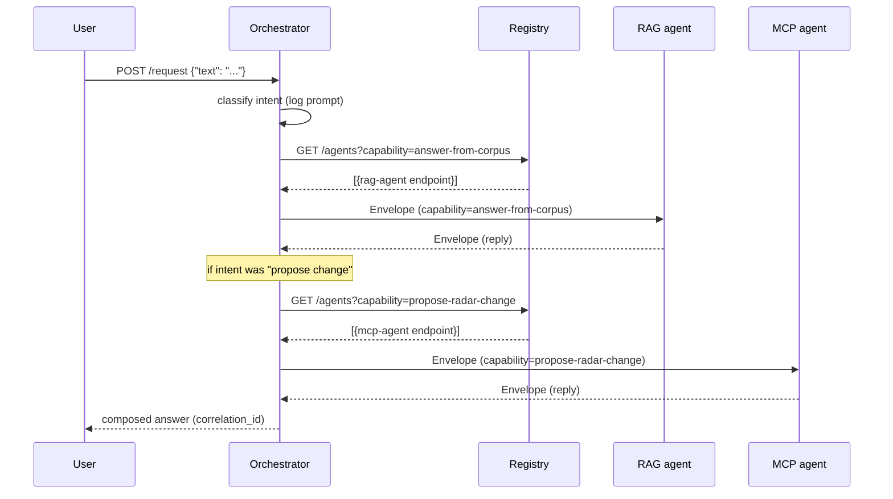

# Exercise C — A2A Multi-Agent Orchestration (Tech Radar Concierge)

Three agents compose a Tech Radar concierge: a local-RAG agent answers questions about the radar's history, an MCP-backed agent edits the radar, and an orchestrator routes user requests between them through a registry over HTTP.

| Layer | Choice |
|---|---|
| Scenario | Tech Radar Concierge |
| Transport | HTTP + JSON (FastAPI) |
| Topology | Orchestration (central conductor + SQLite-persisted state) |
| Language | Python 3.11+ |
| Branch | `Team/ExerciseC-ScenarioA` |

See `PLAN.md` for the full team plan, ownership boundaries, and onboarding flow.

## Repo layout

```
envelope/           shared Pydantic message envelope + HTTP client
registry/           FastAPI registry (register/deregister/query/health, TTL heartbeat)
orchestrator/       FastAPI orchestrator (Person 3, in progress)
agents/
  rag_agent/        wraps exercise-a-rag (Person 2, in progress)
  mcp_agent/        wraps exercise-b-mcp (Person 2, in progress)
exercise-a-rag/     vendored from branch local-mode-code-Viraj — read-only
exercise-b-mcp/     vendored from branch Team/ExerciseB-Variant2 — read-only
scripts/            check-ports.sh / free-ports.sh
Makefile            one-command boot
```

## Setup (one-time)

```bash
python3 -m venv .venv
source .venv/bin/activate
pip install -r requirements.txt
```

## Run (one-command)

```bash
make up        # checks ports, starts registry/orchestrator/rag/mcp in background
make down      # stops everything
tail -f logs/*.log
```

If `make up` fails on port check:

```bash
bash scripts/free-ports.sh   # interactive — confirms before killing
```

## Ports

| Service | Port |
|---|---|
| Registry | 8000 |
| Orchestrator | 8001 |
| RAG agent | 8002 |
| MCP agent | 8003 |

## Message envelope

Every cross-agent message is a single `Envelope` object (defined in `envelope/__init__.py`):

| Field | Purpose (one sentence) |
|---|---|
| `correlation_id` | Same across every message in one user request — used to stitch a workflow's logs together. |
| `causation_id` | The id of the message that caused this one — lets you reconstruct the call chain. |
| `idempotency_key` | Receiver dedupes on this — a retried envelope reuses the same key so the work runs once. |
| `sender` | Logical name of the agent emitting this envelope (matches its registry name). |
| `recipient` | Logical name of the intended receiving agent (or capability when broadcasting). |
| `capability` | The capability being invoked — e.g. `answer-from-corpus`, `propose-radar-change`. |
| `payload` | The actual request/response body — schema is per-capability, not enforced here. |
| `timestamp` | ISO-8601 UTC instant the envelope was created — used for timeline ordering in traces. |
| `message_id` | Unique id for THIS envelope — distinct from `idempotency_key` (which a retry reuses). |

## Registry API

| Verb | Path | Purpose |
|---|---|---|
| `POST` | `/register` | Agent declares name, capabilities, endpoint, health URL |
| `DELETE` | `/deregister/:name` | Graceful shutdown |
| `PUT` | `/heartbeat/:name` | Keep-alive (TTL 30s; sweep every 10s) |
| `GET` | `/agents?capability=...` | List agents, optionally filtered |
| `GET` | `/health` | Registry's own health + per-agent staleness |

## Happy-path workflow



## Status

- [x] P1.0 Vendor exercise A and B
- [x] P1.1 Envelope module
- [x] P1.2 Registry service
- [x] P1.3 Shared HTTP client
- [x] P1.4 Makefile / one-command boot
- [x] P1.4b Port helper scripts
- [x] P1.5 README
- [ ] P2.* RAG and MCP A2A wrappers (Person 2)
- [ ] P3.* Orchestrator, observability, failure handling, docs (Person 3)

See `PLAN.md` for the full task list.
