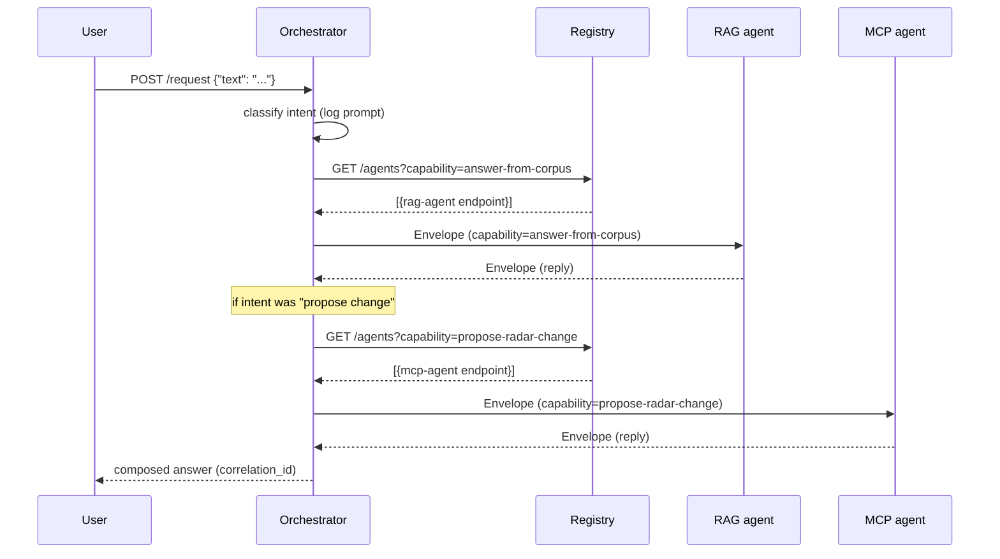

# Exercise C — A2A Multi-Agent Orchestration (Tech Radar Concierge)

Three agents compose a Tech Radar concierge: a local-RAG agent answers questions about the radar's history, an MCP-backed agent edits the radar, and an orchestrator routes user requests between them through a registry over HTTP.

| Layer | Choice |
|---|---|
| Scenario | Tech Radar Concierge |
| Transport | HTTP + JSON (FastAPI) |
| Topology | Orchestration (central conductor + SQLite-persisted state) |
| Language | Python 3.11+ |
| Branch | `Team/ExerciseC-ScenarioA` |

See `PLAN.md` for the full team plan, ownership boundaries, and onboarding flow.

## Demo

Video walkthrough: https://youtu.be/c4OpBx6Ctwo

## Repo layout

```
envelope/             shared Pydantic message envelope + HTTP client
registry/             FastAPI registry (register/deregister/query/health, TTL heartbeat)
orchestrator/         FastAPI orchestrator + SQLite workflow state
  main.py             /request entry point, dispatch loop, retry/poison
  state.py            SQLite store: workflows + poison tables
  classifier.py       intent router (keyword first, LLM fallback hook)
  e2e_test.py         end-to-end happy-path test (read + write + idempotency)
  chaos_test.py       SIGTERM + SIGKILL chaos test (writes logs/chaos-trace.txt)
agents/
  rag_agent/          wraps exercise-a-rag (capability answer-from-corpus)
  mcp_agent/          wraps exercise-b-mcp (capability propose-radar-change)
  lifecycle.py        shared register/heartbeat/idempotency helper
  smoke_test.py       boots registry + both agents and round-trips one envelope to each
observability/
  logger.py           structured ndjson event sink (logs.ndjson)
  query.py            timeline tool: python -m observability.query <correlation_id>
docs/
  topology-decision.md       why orchestration over choreography
  observability-walkthrough.md  two real correlation_ids, walked through
  failure-modes.md           anticipated failures + chaos test write-up
exercise-a-rag/       vendored from branch local-mode-code-Viraj — read-only
exercise-b-mcp/       vendored from branch Team/ExerciseB-Variant2 — read-only
scripts/              check-ports.sh / free-ports.sh
Makefile              one-command boot
```

## Setup (one-time)

Clone the repo, then create and activate a virtual environment before installing dependencies. The `Makefile` auto-detects `.venv/bin/uvicorn`, so once the venv exists `make up` works without re-activating it in new shells.

**macOS / Linux**

```bash
git clone https://github.com/Viraj-77/Ecolab---RAG-Assignment.git
cd Ecolab---RAG-Assignment
git checkout Team/ExerciseC-ScenarioA

python3 -m venv .venv
source .venv/bin/activate
pip install --upgrade pip
pip install -r requirements.txt
```

**Windows (PowerShell)**

```powershell
git clone https://github.com/Viraj-77/Ecolab---RAG-Assignment.git
cd Ecolab---RAG-Assignment
git checkout Team/ExerciseC-ScenarioA

python -m venv .venv
.venv\Scripts\Activate.ps1
python -m pip install --upgrade pip
pip install -r requirements.txt
```

To leave the venv later: `deactivate`.

## Run (one-command)

```bash
make up        # checks ports, starts registry/orchestrator/rag/mcp in background
make down      # stops everything
tail -f logs/*.log
```

If `make up` fails on port check:

```bash
bash scripts/free-ports.sh   # interactive — confirms before killing
```

## Smoke test (Person 2)

```bash
python -m agents.smoke_test
```

Spawns the registry + both business agents in subprocesses, waits for them to become healthy, asserts the registry lists `rag-agent` and `mcp-agent`, then round-trips one envelope to each (capability `answer-from-corpus` and `propose-radar-change`). Exits 0 on success. Useful for catching envelope-shape regressions before the orchestrator is involved.

## End-to-end test (Person 3)

```bash
python -m orchestrator.e2e_test
```

Boots the full system (registry + rag-agent + mcp-agent + orchestrator), then fires three requests through `POST /request`:
1. A read (`"What is the Tech Radar?"`) — keyword-classified to `answer-from-corpus`.
2. An explicit write (`action=add_technology` + params) — routed to `propose-radar-change`.
3. An idempotency probe — same envelope sent twice to rag-agent; second call must return the cached reply byte-for-byte.

Exits 0 on success.

## Chaos test (Person 3)

```bash
python -m orchestrator.chaos_test
```

Runs both failure paths in one go: **SIGTERM** (graceful — agent deregisters; orchestrator fast-fails with `no agent advertises capability ...`), then **SIGKILL** (sudden — registry still lists the dead endpoint; orchestrator retries 3× with the same `idempotency_key` and writes a row to the `poison` table). Writes the structured timeline to `logs/chaos-trace.txt`. See `docs/failure-modes.md` for the walk-through.

## Observability — answering "why did X call Y?"

Every A2A event lands as one JSON line in `observability/logs.ndjson`. Render the timeline for a workflow with:

```bash
python -m observability.query <correlation_id>   # full timeline, ts-sorted
python -m observability.query --list             # last 10 correlation_ids
python -m observability.query --tail             # last 20 events of any kind
```

The classifier emits `intent_classified` events that carry `chosen_capability`, `method`, `matched_keywords`, and (when an LLM is involved) the full prompt and response — so "why did the orchestrator call mcp-agent?" reduces to reading one line. See `docs/observability-walkthrough.md` for two real correlation_ids walked through end-to-end.

## Ports

| Service | Port |
|---|---|
| Registry | 8000 |
| Orchestrator | 8001 |
| RAG agent | 8002 |
| MCP agent | 8003 |

## Message envelope

Every cross-agent message is a single `Envelope` object (defined in `envelope/__init__.py`):

| Field | Purpose (one sentence) |
|---|---|
| `correlation_id` | Same across every message in one user request — used to stitch a workflow's logs together. |
| `causation_id` | The id of the message that caused this one — lets you reconstruct the call chain. |
| `idempotency_key` | Receiver dedupes on this — a retried envelope reuses the same key so the work runs once. |
| `sender` | Logical name of the agent emitting this envelope (matches its registry name). |
| `recipient` | Logical name of the intended receiving agent (or capability when broadcasting). |
| `capability` | The capability being invoked — e.g. `answer-from-corpus`, `propose-radar-change`. |
| `payload` | The actual request/response body — schema is per-capability, not enforced here. |
| `timestamp` | ISO-8601 UTC instant the envelope was created — used for timeline ordering in traces. |
| `message_id` | Unique id for THIS envelope — distinct from `idempotency_key` (which a retry reuses). |

## Registry API

| Verb | Path | Purpose |
|---|---|---|
| `POST` | `/register` | Agent declares name, capabilities, endpoint, health URL |
| `DELETE` | `/deregister/:name` | Graceful shutdown |
| `PUT` | `/heartbeat/:name` | Keep-alive (TTL 30s; sweep every 10s) |
| `GET` | `/agents?capability=...` | List agents, optionally filtered |
| `GET` | `/health` | Registry's own health + per-agent staleness |

## Happy-path workflow



## Composition — what each agent uniquely does

Each of the three processes does something the other two **cannot** — that's the whole point of composing them rather than collapsing the workflow into one monolithic agent.

- **`rag-agent` (capability `answer-from-corpus`)** — owns the *read-side knowledge*. It is the only process with a vector index over the radar's history, ADRs, and supporting documents (vendored from Exercise A). Ask it *why* a technology is in HOLD or *what changed last quarter* and it can answer from the corpus. It cannot mutate the radar — it has no write methods and no idea what `radar.add_technology(...)` even means.
- **`mcp-agent` (capability `propose-radar-change`)** — owns the *write-side authority*. It is the only process holding a `RadarProxy` against `radar_working.json` (vendored from Exercise B Variant 2). It can add a technology, assign it to a team, move it between rings, or remove an assignment — and every successful write is committed to disk. It deliberately does *not* answer free-form questions: its job is to apply structured changes and surface the proxy's validators (e.g. "ADOPT requires a link", "no direct ADOPT↔HOLD jump") as machine-readable errors the orchestrator can act on.
- **`orchestrator` (Person 3)** — owns the *intent and the workflow state*. It is the only process that decides whether a user's request needs reading, writing, or both, and it is the only process that persists workflow state so the system can recover from a mid-flight crash. Neither business agent has any sense of "the user's request" — they each see one envelope at a time.

A monolithic agent that did all three jobs would lose: (a) the read/write blast-radius separation (a buggy retrieval prompt could no longer overwrite the radar), (b) the ability to scale or replace either side independently (swap the local Gemma model into `rag-agent` without touching the writer), and (c) the audit trail — today every cross-agent message is an envelope with a `correlation_id`, so the orchestrator's decision and the eventual radar mutation share one traceable timeline.

## Status

- [x] P1.0 Vendor exercise A and B
- [x] P1.1 Envelope module
- [x] P1.2 Registry service
- [x] P1.3 Shared HTTP client
- [x] P1.4 Makefile / one-command boot
- [x] P1.4b Port helper scripts
- [x] P1.5 README
- [x] P2.1 RAG agent A2A wrapper (port 8002)
- [x] P2.2 MCP agent A2A wrapper (port 8003)
- [x] P2.3 Smoke test (`python -m agents.smoke_test`)
- [x] P2.4 Composition paragraph (above)
- [x] P3.1 Orchestrator + SQLite workflow engine
- [x] P3.2 Failure handling (timeouts, retries with idempotency, poison)
- [x] P3.3 Observability (`observability/logs.ndjson` + `query.py`)
- [x] P3.4 Chaos test (`python -m orchestrator.chaos_test`)
- [x] P3.5 Docs (`docs/topology-decision.md`, `observability-walkthrough.md`, `failure-modes.md`)
- [x] P3.6 Demo recording — https://youtu.be/c4OpBx6Ctwo

See `PLAN.md` for the full task list.
